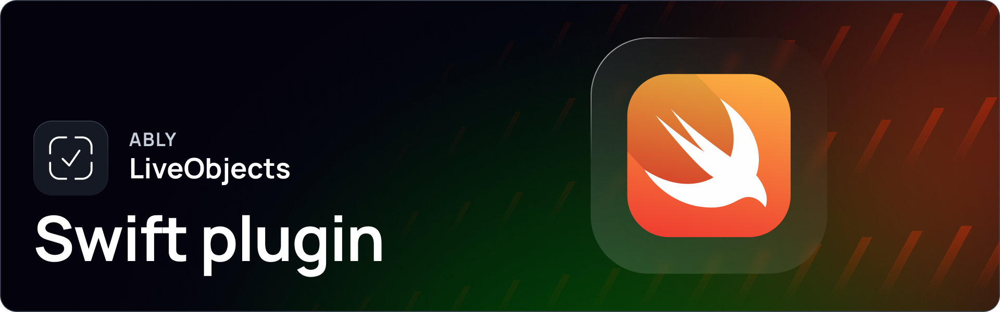

[](https://swiftpackageindex.com/ably/ably-cocoa)
[](https://github.com/ably/ably-cocoa/blob/main/LICENSE)

---

# Ably LiveObjects Swift plugin

The Ably LiveObjects plugin enables real-time collaborative data synchronization for the [ably-cocoa](https://github.com/ably/ably-cocoa/) SDK. LiveObjects provides a simple way to build collaborative applications with synchronized state across multiple clients in real-time. Built on [Ably's](https://ably.com/) core service, it abstracts complex details to enable efficient collaborative architectures.

> [!WARNING]
> This plugin is currently experimental. Breaking changes to its API may be made in minor or patch releases of ably-cocoa, without a major version bump; ably-cocoa's semantic versioning guarantees apply only to the `Ably` product.

> [!NOTE]
> The plugin lives in the [ably-cocoa](https://github.com/ably/ably-cocoa/) repository and is versioned and released as part of ably-cocoa: add the ably-cocoa package to your project and select its `AblyLiveObjects` product. It was previously developed in the [ably-liveobjects-swift-plugin](https://github.com/ably/ably-liveobjects-swift-plugin) repository; if you are coming from that package, see the [migration guide](#migrating-from-the-standalone-plugin-package).

---

## Getting started

Everything you need to get started with Ably LiveObjects:

- [Learn about Ably LiveObjects.](https://ably.com/docs/liveobjects)
- [Getting started with LiveObjects in Swift.](https://ably.com/docs/liveobjects/quickstart/swift)
- Explore the [example app](Example) to see LiveObjects in action.

---

## Migrating from the standalone plugin package

As of ably-cocoa 1.3.0, the plugin is developed, versioned and released from the ably-cocoa repository as the `AblyLiveObjects` product of the ably-cocoa package. The standalone [ably-liveobjects-swift-plugin](https://github.com/ably/ably-liveobjects-swift-plugin) package is deprecated: no further releases will be published from it, and its final release is 0.4.0. Migrating takes two steps.

### Step 1: Swap the package dependency

1. Remove the `ably-liveobjects-swift-plugin` package dependency from your project.
2. Add (or update) the `ably-cocoa` package at version 1.3.0 or later, and select its `AblyLiveObjects` product for your target — see the [installation instructions](../README.md#liveobjects).

Your imports and plugin registration are unchanged:

```swift
import Ably
import AblyLiveObjects

let clientOptions = ARTClientOptions(key: "your-ably-api-key")
clientOptions.plugins = [.liveObjects: AblyLiveObjects.Plugin.self]
```

> [!IMPORTANT]
> If you update ably-cocoa to 1.3.0 or later while the standalone package is still in your dependency graph, package resolution fails immediately with:
>
> ```text
> error: multiple packages ('ably-cocoa', 'ably-cocoa-plugin-support') declare targets with a conflicting name: '_AblyPluginSupportPrivate'; target names need to be unique across the package graph
> error: multiple packages ('ably-cocoa', 'ably-liveobjects-swift-plugin') declare targets with a conflicting name: 'AblyLiveObjects'; target names need to be unique across the package graph
> ```
>
> The fix is to remove the standalone package dependency, as described above.

### Step 2: Adopt the path-based API

ably-cocoa 1.3.0 replaces the instance-based API of the standalone plugin (last published in its 0.4.0 release) with the path-based API: instead of obtaining and operating on explicit `LiveMap`/`LiveCounter` instances, data is accessed and mutated through `PathObject`s — stable references to locations within the channel object that resolve to values dynamically at runtime. See the [PathObject documentation](https://ably.com/docs/liveobjects/concepts/path-object).

The headline API changes:

| Standalone plugin (≤ 0.4.x)                                    | ably-cocoa 1.3.0+                                                                                                 |
| -------------------------------------------------------------- | ----------------------------------------------------------------------------------------------------------------- |
| `channel.objects`, returning `RealtimeObjects`                 | `channel.object`, returning `RealtimeObject`                                                                      |
| `try await channel.objects.getRoot()`, returning `any LiveMap` | `try await channel.object.get()`, returning `any LiveMapPathObject`                                               |
| Operate on explicit `LiveMap`/`LiveCounter` instances          | Navigate with `PathObject`s: `root.get(key:)`, then cast with `asLiveMap()` / `asLiveCounter()` / `asPrimitive()` |

For example:

```swift
// Standalone plugin (≤ 0.4.x) — instance-based
let root = try await channel.objects.getRoot()
try await root.set(key: "myKey", value: "myValue")
let value = try root.get(key: "myKey")

// ably-cocoa 1.3.0+ — path-based
let root = try await channel.object.get()
try await root.set(key: "myKey", value: "myValue")
let value = try root.get(key: "myKey").asPrimitive().value()?.stringValue
```

A `PathObject` is purely navigational: it can be created before the data at its path exists, and it survives the object at its path being replaced — there is no need to re-fetch anything when the underlying object changes. The [example app](Example) demonstrates the path-based API end-to-end.

---

## Supported platforms

Ably aims to support a wide range of platforms. If you experience any compatibility issues, open an issue in the repository or contact [Ably support](https://ably.com/support).

This plugin supports the following platforms:

| Platform | Support |
| -------- | ------- |
| iOS      | >= 14.0 |
| macOS    | >= 11.0 |
| tvOS     | >= 14.0 |

> [!NOTE]
> Xcode 16.3 or later is required.

---

## Example app

This repository contains an example app, written using SwiftUI, which demonstrates how to use the plugin. The code for this app is in the [`Example`](Example) directory.

In order to allow the app to use modern SwiftUI features, it supports the following OS versions:

- macOS 14 and above
- iOS 17 and above
- tvOS 17 and above

To run the app:

1. Open the `AblyLiveObjects.xcworkspace` workspace in Xcode.
2. Follow the instructions inside the `Secrets.example.swift` file to add your Ably API key to the example app.
3. Run the `AblyLiveObjectsExample` target. If you wish to run it on an iOS or tvOS device, you'll need to set up code signing.

---

## Releases

The plugin is released as part of ably-cocoa; see the [ably-cocoa CHANGELOG](../CHANGELOG.md) for details of releases (and [CHANGELOG.md](./CHANGELOG.md) for the historical releases of the standalone plugin package). You can also view all Ably releases on [changelog.ably.com](https://changelog.ably.com).

---

## Contribute

Read the [CONTRIBUTING.md](./CONTRIBUTING.md) guidelines to contribute to Ably or [share feedback or request a new feature](https://forms.gle/mBw9M53NYuCBLFpMA).

## Support, feedback and troubleshooting

For help or technical support, visit Ably's [support page](https://ably.com/support). You can also view the [community-reported GitHub issues](https://github.com/ably/ably-cocoa/issues) or raise one yourself.
