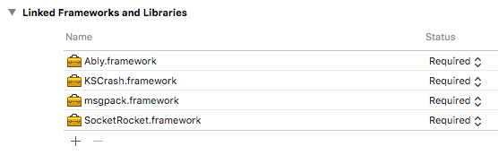

# [Ably](https://www.ably.io) iOS client library

[](https://travis-ci.org/ably/ably-ios)
[](https://img.shields.io/cocoapods/v/Ably.svg)
[](https://github.com/Carthage/Carthage)


An iOS client library for [ably.io](https://www.ably.io), the realtime messaging service, written in Objective-C.

## Supported platforms

This SDK is compatible with projects that target:

- iOS 8.0+
- tvOS 10.0+
- macOS 10.11+

We maintain compatibility and explicitly support these platform versions, including performing CI testing on all library revisions.

We do not explicitly maintain compatibility with older platform versions; we no longer perform CI testing on iOS 8 as of version 1.0.12 (released on January 31st 2018). Any known incompatibilities with older versions can be found [here](https://github.com/ably/ably-ios/issues?q=is%3Aissue+is%3Aopen+label%3A%22compatibility%22).

If you find any issues with unsupported platform versions, please [raise an issue](https://github.com/ably/ably-ios/issues) in this repository or [contact Ably customer support](https://support.ably.io) for advice.

#### Acknowledgments

As of version `1.1.3` this library based on the 1.1 library specification. It implements a subset of 1.1 features:
- updated push API and push device authentication;
- support for enforcement of the `maxMessageSize` attribute
Other minor features and bugfixes are included, as listed in the [changelog](CHANGELOG.md#113-2019-01-10).

##### macOS & tvOS

Please be aware that Push Notifications are currently unsupported. You can only use the [Push Admin](https://www.ably.io/documentation/general/push/admin) functionalities, for example:

```swift
let recipient: [String: Any] = [
    "clientId": "C04BC116-8004-4D78-A71F-8CA3122734DB"
]
let data: [String: Any] = [
    "notification": [
        "title": "Hello from Ably!",
        "body": "Example push notification from Ably."
    ],
    "data": [
        "foo": "bar",
        "baz": "qux"
    ]
]
realtime.push.admin.publish(recipient, data: data) { error in
    print("Push published:", error ?? "nil")
}
```

Demos available: [macOS](https://github.com/ably/demo-macos) and [tvOS](https://github.com/ably/demo-tvos).

## Documentation

Visit [ably.io/documentation](https://www.ably.io/documentation) for a complete API reference and more examples.

## Installation Guide

You can install Ably for iOS and macOS through CocoaPods, Carthage or manually.

### Installing through [CocoaPods](https://cocoapods.org/)

Add this line to your application's Podfile:

    # For Xcode 7.3 and newer
    pod 'Ably', '~> 1.1'

And then install the dependency:

    $ pod install

### Installing through [Carthage](https://github.com/Carthage/Carthage/)

Add this line to your application's Cartfile:

    # For Xcode 7.3 and newer
    github "ably/ably-ios" ~> 1.1

And then run `carthage update` to build the framework and drag the built Ably.framework into your Xcode project.

If you see, for example, a `dyld: Library not loaded: @rpath/SocketRocket.framework/SocketRocket` error, then most likely you forgot to add all the dependencies to your project. You have more detailed information [here](https://github.com/Carthage/Carthage#adding-frameworks-to-an-application).



### Manual installation 

1. Get the code from GitHub [from the release page](https://github.com/ably/ably-ios/releases/tag/1.1.3), or clone it to get the latest, unstable and possibly underdocumented version: `git clone git@github.com:ably/ably-ios.git`
2. Drag the directory `ably-ios/ably-ios` into your project as a group.
3. Ably depends on our [SocketRocket Fork](https://github.com/ably-forks/SocketRocket) 0.5.2; get it [from the releases page](https://github.com/ably-forks/SocketRocket/releases/tag/0.5.2-ably-2) and follow [its manual installation instructions](https://github.com/ably-forks/SocketRocket/#installing).
4. Ably also depends on our [MessagePack Fork](https://github.com/ably-forks/msgpack-objective-C) 0.2.0; get it [from the releases page](https://github.com/ably-forks/msgpack-objective-C/releases/tag/0.2.0-ably-1) and link it into your project.

## Thread-safety

The library makes the following thread-safety guarantees:

* The whole public interface can be safely accessed, both for read and writing, from any thread.
* "Value" objects (e. g. `ARTTokenDetails`, data from messages) returned by the library can be safely read from and written to.
* Objects passed to the library must not be mutated afterwards. They can be safely passed again, or read from; they won't be written to by the library.

All internal operations are dispatched to a single serial GCD queue. You can specify a custom queue for this, which must be serial, with `ARTClientOptions.internalDispatchQueue`.

All calls to callbacks provided by the user are dispatched to the main queue by default.
This allows you to react to Ably's output by doing UI operations directly. You can specify a different queue with `ARTClientOptions.dispatchQueue`. It shouldn't be the same queue as the `ARTClientOptions.internalDispatchQueue`, since that can lead to deadlocks.

## Using the Realtime API

<!--
NOTE NOTE NOTE NOTE NOTE NOTE NOTE NOTE NOTE N
**********************************************
==============================================

(Sorry for the noise.)

Those examples need to be kept in sync with:

ablySpec/ReadmeExamples.swift
ably-iosTests/ARTReadmeExamples.m

==============================================
**********************************************
OTE NOTE NOTE NOTE NOTE NOTE NOTE NOTE NOTE NO
-->

### Introduction

All examples assume a client has been created as follows:

**Swift**

```swift
// basic auth with an API key
let client = ARTRealtime(key: "xxxx:xxxx")

// using token auth
let client = ARTRealtime(token: "xxxx")
```

**Objective-C**

```objective-c
// basic auth with an API key
ARTRealtime* client = [[ARTRealtime alloc] initWithKey:@"xxxx:xxxx"];

// using token auth
ARTRealtime* client = [[ARTRealtime alloc] initWithToken:@"xxxx"];
```

### Connection

Instantiating `ARTRealtime` starts a connection by default. You can catch connection success or error by listening to the connection's state changes:

**Swift**

```swift
client.connection.on { stateChange in
    let stateChange = stateChange!
    switch stateChange.current {
    case .Connected:
        print("connected!")
    case .Failed:
        print("failed! \(stateChange.reason)")
    default:
        break
    }
}
```

**Objective-C**

```objective-c
[client.connection on:^(ARTConnectionStateChange *stateChange) {
    switch (stateChange.current) {
        case ARTRealtimeConnected:
            NSLog(@"connected!");
            break;
        case ARTRealtimeFailed:
            NSLog(@"failed! %@", stateChange.reason);
            break;
        default:
            break;
    }
}];
```

You can also connect manually by setting the appropiate option.

**Swift**

```swift
let options = ARTClientOptions(key: "xxxx:xxxx")
options.autoConnect = false
let client = ARTRealtime(options: options)
client.connection.connect()
```

**Objective-C**

```objective-c
ARTClientOptions *options = [[ARTClientOptions alloc] initWithKey:@"xxxx:xxxx"];
options.autoConnect = false;
ARTRealtime *client = [[ARTRealtime alloc] initWithOptions:options];
[client.connection connect];
```

### Subscribing to a channel

Given:

**Swift**

```swift
let channel = client.channels.get("test")
```

**Objective-C**

```objective-c
ARTRealtimeChannel *channel = [client.channels get:@"test"];
```

Subscribe to all events:

**Swift**

```swift
channel.subscribe { message in
    print(message.name)
    print(message.data)
}
```

**Objective-C**

```objective-c
[channel subscribe:^(ARTMessage *message) {
    NSLog(@"%@", message.name);
    NSLog(@"%@", message.data);
}];
```

Only certain events:

**Swift**

```swift
channel.subscribe("myEvent") { message in
    print(message.name)
    print(message.data)
}
```

**Objective-C**

```objective-c
[channel subscribe:@"myEvent" callback:^(ARTMessage *message) {
    NSLog(@"%@", message.name);
    NSLog(@"%@", message.data);
}];
```

### Publishing to a channel

**Swift**

```swift
channel.publish("greeting", data: "Hello World!")
```

**Objective-C**

```objective-c
[channel publish:@"greeting" data:@"Hello World!"];
```

### Querying the history

**Swift**

```swift
channel.history { messagesPage, error in
    let messagesPage = messagesPage!
    print(messagesPage.items)
    print(messagesPage.items.first)
    print((messagesPage.items.first as? ARTMessage)?.data) // payload for the message
    print(messagesPage.items.count) // number of messages in the current page of history
    messagesPage.next { nextPage, error in
        // retrieved the next page in nextPage
    }
    print(messagesPage.hasNext) // true, there are more pages
}
```

**Objective-C**

```objective-c
[channel history:^(ARTPaginatedResult<ARTMessage *> *messagesPage, ARTErrorInfo *error) {
    NSLog(@"%@", messagesPage.items);
    NSLog(@"%@", messagesPage.items.firstObject);
    NSLog(@"%@", messagesPage.items.firstObject.data); // payload for the message
    NSLog(@"%lu", (unsigned long)[messagesPage.items count]); // number of messages in the current page of history
    [messagesPage next:^(ARTPaginatedResult<ARTMessage *> *nextPage, ARTErrorInfo *error) {
        // retrieved the next page in nextPage
    }];
    NSLog(@"%d", messagesPage.hasNext); // true, there are more pages
}];
```

### Presence on a channel

**Swift**

```swift
let channel = client.channels.get("test")

channel.presence.enter("john.doe") { errorInfo in
    channel.presence.get { members, errorInfo in
        // members is the array of members present
    }
}
```

**Objective-C**

```objective-c
[channel.presence enter:@"john.doe" callback:^(ARTErrorInfo *errorInfo) {
    [channel.presence get:^(ARTPaginatedResult<ARTPresenceMessage *> *result, ARTErrorInfo *error) {
        // members is the array of members present
    }];
}];
```

### Querying the presence history

**Swift**

```swift
channel.presence.history { presencePage, error in
    let presencePage = presencePage!
    if let first = presencePage.items.first as? ARTPresenceMessage {
        print(first.action) // Any of .Enter, .Update or .Leave
        print(first.clientId) // client ID of member
        print(first.data) // optional data payload of member
        presencePage.next { nextPage, error in
            // retrieved the next page in nextPage
        }
    }
}
```

**Objective-C**

```objective-c
[channel.presence history:^(ARTPaginatedResult<ARTPresenceMessage *> *presencePage, ARTErrorInfo *error) {
    ARTPresenceMessage *first = (ARTPresenceMessage *)presencePage.items.firstObject;
    NSLog(@"%lu", (unsigned long)first.action); // Any of ARTPresenceEnter, ARTPresenceUpdate or ARTPresenceLeave
    NSLog(@"%@", first.clientId); // client ID of member
    NSLog(@"%@", first.data); // optional data payload of member
    [presencePage next:^(ARTPaginatedResult<ARTPresenceMessage *> *nextPage, ARTErrorInfo *error) {
        // retrieved the next page in nextPage
    }];
}];
```

### Using the `authCallback`

A callback to call to obtain a signed token request.  
`ARTClientOptions` and `ARTRealtime` objects can be instantiated as follow:

**Swift**

```swift
let clientOptions = ARTClientOptions()
clientOptions.authCallback = { params, callback in
    getTokenRequestJSONFromYourServer(params) { json, error in
        //handle error
        do {
            callback(try ARTTokenRequest.fromJson(json), nil)
        } catch let error as NSError {
            callback(nil, error)
        }
    }
}

let client = ARTRealtime(options:clientOptions)
```

**Objective-C**

```objective-c
ARTClientOptions *clientOptions = [[ARTClientOptions alloc] init];
clientOptions.authCallback = ^(ARTTokenParams *params, void(^callback)(id<ARTTokenDetailsCompatible>, NSError*)) {
    [self getTokenRequestJSONFromYourServer:params completion:^(NSDictionary *json, NSError *error) {
        //handle error
        ARTTokenRequest *tokenRequest = [ARTTokenRequest fromJson:json error:&error];
        callback(tokenRequest, error);
    }];
};

ARTRealtime *client = [[ARTRealtime alloc] initWithOptions:clientOptions];
```

## Using the REST API

### Introduction

All examples assume a client and/or channel has been created as follows:

**Swift**

```swift
let client = ARTRest(key: "xxxx:xxxx")
let channel = client.channels.get("test")
```

**Objective-C**

```objective-c
ARTRest *client = [[ARTRest alloc] initWithKey:@"xxxx:xxxx"];
ARTRestChannel *channel = [client.channels get:@"test"];
```

### Publishing a message to a channel

**Swift**

```swift
channel.publish("myEvent", data: "Hello!")
```

**Objective-C**

```objective-c
[channel publish:@"myEvent" data:@"Hello!"];
```

### Querying the history

**Swift**

```swift
channel.history { messagesPage, error in
    let messagesPage = messagesPage!
    print(messagesPage.items.first)
    print((messagesPage.items.first as? ARTMessage)?.data) // payload for the message
    messagesPage.next { nextPage, error in
        // retrieved the next page in nextPage
    }
    print(messagesPage.hasNext) // true, there are more pages
}
```

**Objective-C**

```objective-c
[channel history:^(ARTPaginatedResult<ARTMessage *> *messagesPage, ARTErrorInfo *error) {
    NSLog(@"%@", messagesPage.items.firstObject);
    NSLog(@"%@", messagesPage.items.firstObject.data); // payload for the message
    NSLog(@"%lu", (unsigned long)[messagesPage.items count]); // number of messages in the current page of history
    [messagesPage next:^(ARTPaginatedResult<ARTMessage *> *nextPage, ARTErrorInfo *error) {
        // retrieved the next page in nextPage
    }];
    NSLog(@"%d", messagesPage.hasNext); // true, there are more pages
}];
```

### Presence on a channel

**Swift**

```swift
channel.presence.get { membersPage, error in
    let membersPage = membersPage!
    print(membersPage.items.first)
    print((membersPage.items.first as? ARTPresenceMessage)?.data) // payload for the message
    membersPage.next { nextPage, error in
        // retrieved the next page in nextPage
    }
    print(membersPage.hasNext) // true, there are more pages
}
```

**Objective-C**

```objective-c
[channel.presence get:^(ARTPaginatedResult<ARTPresenceMessage *> *membersPage, ARTErrorInfo *error) {
    NSLog(@"%@", membersPage.items.firstObject);
    NSLog(@"%@", membersPage.items.firstObject.data); // payload for the message
    [membersPage next:^(ARTPaginatedResult<ARTMessage *> *nextPage, ARTErrorInfo *error) {
        // retrieved the next page in nextPage
    }];
    NSLog(@"%d", membersPage.hasNext); // true, there are more pages
}];
```

### Querying the presence history

**Swift**

```swift
channel.presence.history { presencePage, error in
    let presencePage = presencePage!
    if let first = presencePage.items.first as? ARTPresenceMessage {
        print(first.clientId) // client ID of member
        presencePage.next { nextPage, error in
            // retrieved the next page in nextPage
        }
    }
}
```

**Objective-C**

```objective-c
[channel.presence history:^(ARTPaginatedResult<ARTPresenceMessage *> *presencePage, ARTErrorInfo *error) {
    ARTPresenceMessage *first = (ARTPresenceMessage *)presencePage.items.firstObject;
    NSLog(@"%@", first.clientId); // client ID of member
    NSLog(@"%@", first.data); // optional data payload of member
    [presencePage next:^(ARTPaginatedResult<ARTPresenceMessage *> *nextPage, ARTErrorInfo *error) {
        // retrieved the next page in nextPage
    }];
}];
```

### Generate token

**Swift**

```swift
client.auth.requestToken(nil, withOptions: nil) { tokenDetails, error in
    let tokenDetails = tokenDetails!
    print(tokenDetails.token) // "xVLyHw.CLchevH3hF....MDh9ZC_Q"
    let client = ARTRest(token: tokenDetails.token)
}
```

**Objective-C**

```objective-c
[client.auth requestToken:nil withOptions:nil callback:^(ARTTokenDetails *tokenDetails, NSError *error) {
    NSLog(@"%@", tokenDetails.token); // "xVLyHw.CLchevH3hF....MDh9ZC_Q"
    ARTRest *client = [[ARTRest alloc] initWithToken:tokenDetails.token];
}];
```

### Fetching your application's stats

**Swift**

```swift
client.stats { statsPage, error in
    let statsPage = statsPage!
    print(statsPage.items.first)
    statsPage.next { nextPage, error in
        // retrieved the next page in nextPage
    }
}
```

**Objective-C**

```objective-c
[client stats:^(ARTPaginatedResult<ARTStats *> *statsPage, ARTErrorInfo *error) {
    NSLog(@"%@", statsPage.items.firstObject);
    [statsPage next:^(ARTPaginatedResult<ARTStats *> *nextPage, ARTErrorInfo *error) {
        // retrieved the next page in nextPage
    }];
}];
```

### Fetching the Ably service time

**Swift**

```swift
client.time { time, error in
    print(time) // 2016-02-09 03:59:24 +0000
}
```

**Objective-C**

```objective-c
[client time:^(NSDate *time, NSError *error) {
    NSLog(@"%@", time); // 2016-02-09 03:59:24 +0000
}];
```

## Support, feedback and troubleshooting

Please visit http://support.ably.io/ for access to our knowledgebase and to ask for any assistance.

You can also view the [community reported Github issues](https://github.com/ably/ably-ios/issues).

## Contributing

In this repo the `master` branch contains the latest stable version of the Ably SDK. Pushing changes to the `master` branch is locked. All the development (bug fixing, feature implementation, etc.) is done against the `develop` branch, which you should branch from whenever you'd like to make modifications. Here's the steps to follow when contributing to this repo.

1. Fork it
2. Setup or update your machine by running `make setup|update`
3. Create your feature branch from `develop` (`git checkout develop && git checkout -b my-new-feature-branch`)
4. Commit your changes (`git commit -am 'Add some feature'`)
5. Ensure you have added suitable tests and the test suite is passing
6. Push to the branch (`git push origin my-new-feature-branch`)
7. Create a new Pull Request

## Running tests

To run tests use `make test_[iOS|tvOS|macOS]`.

Note: [Fastlane](https://fastlane.tools) should be installed.

## Release Process

This library uses [semantic versioning](http://semver.org/). For each release, the following needs to be done:

* Create a new branch `release-x.x.x` (where `x.x.x` is the new version number) from the `develop` branch
* Run `make bump_[major|minor|patch]` to bump the new version number.
* Run [`github_changelog_generator`](https://github.com/skywinder/Github-Changelog-Generator) to automate the update of the [CHANGELOG](./CHANGELOG.md). Once the CHANGELOG has completed, manually change the `Unreleased` heading and link with the current version number such as `v1.0.0`. Also ensure that the `Full Changelog` link points to the new version tag instead of the `HEAD`. Commit this change.
* Push tag to origin such as `git push origin x.x.x`.
* Make a PR against `develop`
* Wait for review. Once the PR is approved, merge it into `develop`
* Fast-forward the master branch: `git checkout master && git merge --ff-only develop && git push origin master`
* Visit [releases page](https://github.com/ably/ably-ios/releases) and `Add release notes`.
* Release an update for CocoaPods: `(pod lib lint && pod trunk push Ably.podspec)`.
* Generate the prebuilt framework for Carthage (`(carthage build --no-skip-current && carthage archive Ably)`) and attach the zip file to the release.

## License

Copyright (c) 2018 Ably Real-time Ltd, Licensed under the Apache License, Version 2.0.  Refer to [LICENSE](LICENSE) for the license terms.
