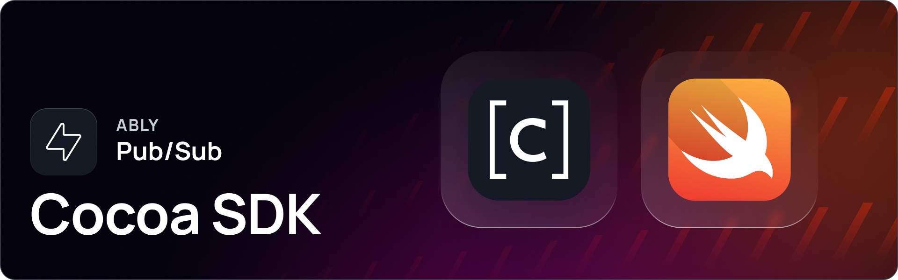

[](https://swiftpackageindex.com/ably/ably-cocoa)
[](https://github.com/ably/ably-cocoa/blob/main/LICENSE)

# Ably Pub/Sub Cocoa SDK

Build any realtime experience using Ably’s Pub/Sub Cocoa SDK. Supported on all popular platforms and frameworks, including Swift and Objective-C.

Ably Pub/Sub provides flexible APIs that deliver features such as pub-sub messaging, message history, presence, and push notifications. Utilizing Ably’s realtime messaging platform, applications benefit from its highly performant, reliable, and scalable infrastructure.

Find out more:

* [Ably Pub/Sub docs.](https://ably.com/docs/basics)
* [Ably Pub/Sub examples.](https://ably.com/examples?product=pubsub)

---

## Getting started

Everything you need to get started with Ably:

* [Getting started in Pub/Sub using Swift.](https://ably.com/docs/getting-started/swift?lang=swift)
* [SDK Setup for Swift.](https://ably.com/docs/getting-started/setup?lang=swift)

---

## Supported platforms

Ably aims to support a wide range of platforms. If you experience any compatibility issues, open an issue in the repository or contact [Ably support](https://ably.com/support).

The following platforms are supported:

| Platform | Support |
|----------|---------|
| iOS| >= 10 |
| macOS| >= 10.12 |
| tvOS | >= 10 |

> [!IMPORTANT]
> Ably Cocoa SDK versions below 1.2.23 will be [deprecated](https://ably.com/docs/platform/deprecate/protocol-v1) from November 1, 2025.

---

## Installation

You can install Ably for iOS and macOS through [Swift package manager](#swift-package-manager), [CocoaPods](#cocoapods), [Carthage](#carthage) or [install manually](#manual-install).

### Swift Package Manager

The Ably Pub/Sub SDK includes installation support for [Swift Package Manager](https://swift.org/package-manager/).

<details>
<summary>Swift Package Manager installation details.</summary>

To install the `ably-cocoa` package in your Xcode project: 

* Paste `https://github.com/ably/ably-cocoa` in the *Swift Packages* search box. ( *Xcode project*  &rarr;  *Swift Packages..* . &rarr; `+` button)
* Select the `Ably` SDK for your target.

To install the `ably-cocoa` package in another Swift package, add the following to your `Package.Swift`:

```swift
 .package(url: "https://github.com/ably/ably-cocoa", from: "1.2.45"),
```

See Apple's [adding package dependencies to your app](https://developer.apple.com/documentation/swift_packages/adding_package_dependencies_to_your_app) guide for more detail.
</details>

### CocoaPods

The Ably Pub/Sub SDK includes installation support for [CocoaPods](https://cocoapods.org/).

<details>
<summary>CocoaPods installation details.</summary>

If you intend to use Swift, using `use_frameworks!` in your Podfile is recommended (this will create a Framework that can be used in Swift natively).

Add this line to your application's Podfile:

```ruby
# For Xcode 7.3 and newer
pod 'Ably', '>= 1.2'
```

And then install the dependency:

```bash
$ pod install
```

</details>


### Carthage

The Ably Pub/Sub SDK includes installation support for [Carthage](https://github.com/Carthage/Carthage/).

<details>
<summary>Carthage installation details.</summary>

Add the following line to your application's Cartfile:

```ruby
# For Xcode 7.3 and newer
github "ably/ably-cocoa" >= 1.2
```

And then run one of the following commands required for your platform:

| Platform | Command |
|----------|---------|
| iOS | `carthage update --use-xcframeworks --platform iOS --no-use-binaries` |
| macOS | `carthage update --use-xcframeworks --platform macOS --no-use-binaries`|
| tvOS | `carthage update --use-xcframeworks --platform tvOS --no-use-binaries` |

After building the framework (located in `[PROJECT_ROOT]/Carthage/Build`), drag the following files into the **Frameworks**, **Libraries**, and **Embedded content** section of your Xcode target’s **General** tab:

* `Ably.xcframework`
* `AblyDeltaCodec.xcframework`
* `msgpack.xcframework`
* For applications, select **Embed & Sign**
* For other targets, select **Do Not Embed**

If you encounter an error similar to the following, you’ve likely missed adding one or more required dependencies:

```
dyld: Library not loaded: @rpath/AblyDeltaCodec.framework/AblyDeltaCodec
```

For further information review the Carthage [adding frameworks to an application](https://github.com/Carthage/Carthage#adding-frameworks-to-an-application) guide.

</details>

### Manual install

The Ably Pub/Sub SDK includes manual installation support.

<details>
<summary>Manual installation details.</summary>

* Download the [Ably Pub/Sub Cocoa SDK.](https://github.com/ably/ably-cocoa)
* Drag the `ably-cocoa/ably-cocoa` directory into your Xcode project as a group.

Ably depends on our [MessagePack Fork](https://github.com/ably-forks/msgpack-objective-C) 0.2.0; get it [from the releases page](https://github.com/ably-forks/msgpack-objective-C/releases/tag/0.2.0-ably-1) and link it into your project.

</details>

---

## Usage

```swift
// Initialize Ably Realtime client
let clientOptions = ARTClientOptions(key: "your-ably-api-key")
clientOptions.clientId = "me"
let realtime = ARTRealtime(options: clientOptions)

// Wait for connection to be established
realtime.connection.on { stateChange in
    if stateChange.current == .connected {
        print("Connected to Ably")
        
        // Get a reference to the 'test-channel' channel
        let channel = realtime.channels.get("test-channel")
        
        // Subscribe to all messages published to this channel
        channel.subscribe { message in
            print("Received message: \(message.data ?? "")")
        }
        
        // Publish a test message to the channel
        channel.publish("test-event", data: "hello world!") { error in
            guard error == nil else {
                print("Error publishing message: \(error!.message)")
                return
            }
            print("Message successfully published")
        }
    }
}
```

---

## Contribute

Read the [CONTRIBUTING.md](./CONTRIBUTING.md) guidelines to contribute to Ably.

---

## Releases

The [CHANGELOG.md](./CHANGELOG.md) contains details of the latest releases for this SDK. You can also view all Ably releases on [changelog.ably.com](https://changelog.ably.com).

---

## Support, feedback, and troubleshooting

For help or technical support, visit Ably's [support page](https://ably.com/support) or [GitHub Issues](https://github.com/ably/ably-cocoa/issues) for community-reported bugs and discussions.
