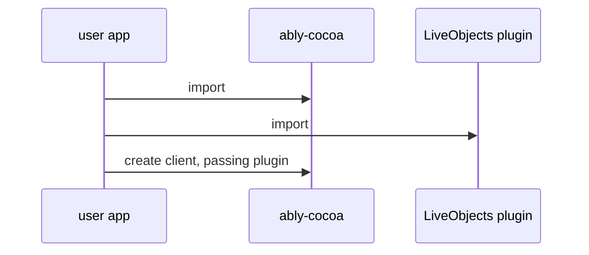
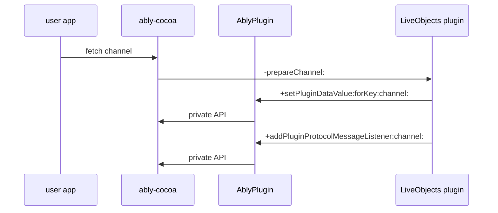
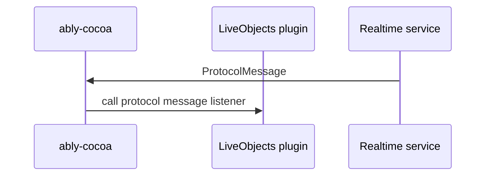
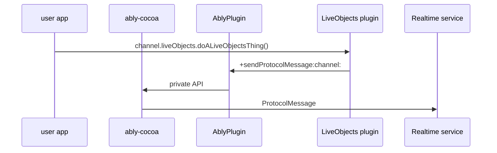

# DR-xxx: Plugins for ably-cocoa SDK

## Background

We are going to introduce LiveObjects functionality into the ably-cocoa SDK in a way that meets the requirements outlined in https://ably.atlassian.net/wiki/spaces/SDK/pages/3814752393/LiveObject+Feature+-+Requirements+Design+Considerations.

I think that, from those requirements, the ones which are most interesting to explore for ably-cocoa are how we can build something which:

- is optional so as not to increase ably-cocoa size
- can be implemented in Swift, using latest Swift language features
- is unshackled from ably-cocoa's ancient OS requirements
- can offer an API that uses Swift language features
- can consume plugin-only API from ably-cocoa

The rest of this DR is written with reference to the specific example of LiveObjects functionality, but the intention is to provide an outline for how we would also implement further plugins in the future.

## Proposal

### Distribution and OS requirements

- We will only offer the LiveObjects SDK as a Swift Package Manager (SPM) package. The other package managers that we currently support in ably-cocoa, namely Carthage and CocoaPods, are rarely used for new projects and are not very maintained (CocoaPods is basically [being shut down by the end of 2026](https://blog.cocoapods.org/CocoaPods-Specs-Repo/)), and we already intend to remove support for them in the next major version of ably-cocoa.
- We will distribute the LiveObjects SDK as a separate Swift package (thus necessitating us also distributing it in a separate Git repository) to ably-cocoa. This is because OS version requirements are package-wide, and we do not wish LiveObjects to be bound by ably-cocoa's OS requirements. LiveObjects will follow the same OS requirements as used in our Swift Chat SDK (the decisions that led to the Chat OS requirements can be found in [this commit message](https://github.com/ably/ably-chat-swift/commit/646c220cb68b4b184ed48412077ee96d13e64798)), unless we discover a compelling reason to only support even newer OS versions.

### Example implementation

An working example of the implementation which I describe below can be found in:

- https://github.com/ably/ably-cocoa/pull/2039 - draft PR that adds a plugins mechanism to ably-cocoa, including the ability to pass a LiveObjects plugin
- https://github.com/lawrence-forooghian/ably-cocoa-liveobjects-plugin - the LiveObjects plugin Swift package
- https://github.com/lawrence-forooghian/ably-cocoa-liveobjects-example - a command-line app that uses the LiveObjects plugin

### Structure

#### Initial setup

This sequence diagram shows the initial setup of the LiveObjects plugin:

The participants are the following:

- user app: an application written by a user who wishes to use LiveObjects functionality
- ably-cocoa: The core SDK
- LiveObjects plugin: a class exported by the LiveObjects plugin Swift package

ably-cocoa's `ClientOptions` will now implement the `plugins` option described in [TO3o](https://sdk.ably.com/builds/ably/specification/main/features/#TO3o).

When the user app imports the LiveObjects plugin package, the ably-cocoa `ARTRealtimeChannel` type will be extended to provide a public `liveObjects` property. The return property of this type is a Swift type that exposes an API that can use Swift language features. Below I describe how this property will be implemented.

#### Hooking into channel

This sequence diagram shows how the LiveObjects plugin hooks in to the channel, allowing it to provide the `channel.liveObjects` property and (as an example of finding out non-public core SDK information) registering to receive information about incoming `ProtocolMessage`s:

The additional participant here is the `AblyPlugin` library. This is a new library, which:

- is exported by the ably-cocoa SPM package
- is only intended for use by Ably-authored plugins
- offers access to private API of the core SDK
   - the intention is that this provide a _stable_ API that plugins can depend on, allowing the internals of the SDK to continue to evolve
   - as currently written, it does also directly expose the `ARTProtocolMessage` type; we can consider whether we wish to do this, or wrap it in a guaranteed-to-be-stable type for plugin consumption (I didn't explore this here because I think that this is a pretty stable type)
   - implementation note: `AblyPlugin` is able to access the internals of ably-cocoa because it lives in the same repository and thus can be configured to have access to ably-cocoa's private headers. This is easy because all of ably-cocoa is currently written in Objective-C. We would have to revisit this approach if we were to rewrite some of ably-cocoa in Swift, but since we don't yet know what such an ably-cocoa would look like it's hard to speculate about what approach we'd use instead. Given that such a rewrite would very likely coincide with a new major release of ably-cocoa, we'd be able to completely revisit the plugin approach at that moment.
- in our example, the current APIs that it offers are:
   - `+setPluginDataValue:forKey:channel:`, which allows a plugin to store arbitrary key-value data on a channel instance; this is used to provide the backing storage for the `channel.liveObjects` property
   - `+addPluginProtocolMessageListener:channel:`, which allows a plugin to register a listener that receives all `ProtocolMessage`s received on a channel
   - `+sendProtocolMessage:channel:`, which requests that ably-cocoa send a `ProtocolMessage` on a channel
- is imported by the LiveObjects plugin using the recent Swift language feature `internal import` (see [SE-0409: Access-level modifiers on import declarations](https://github.com/swiftlang/swift-evolution/blob/main/proposals/0409-access-level-on-imports.md)), which means that none of `AblyPlugin`'s API gets exposed to users of the LiveObjects plugin

#### Receiving `ProtocolMessage`s

This sequence diagram shows how the LiveObjects plugin receives incoming `ProtocolMessage`s via the previously-registered listener:

(In the case of LiveObjects, the LiveObjects plugin would then use this `ProtocolMessage` to update some internal state and notify the user about the new state of some live object.)

#### Sending `ProtocolMessage`s

The example implementation also demonstrates how the LiveObjects plugin might request that ably-cocoa send a `ProtocolMessage` on a channel, in response to a user calling the example method `channel.liveObjects.doALiveObjectsThing()`. If what's been proposed until now makes sense, then what's shown below probably isn't very surprising, but here it is for the sake of completeness.

## Alternatives considered

- Using a module map to expose a plugin API via a Clang submodule (i.e. `import Ably.PluginAPI`). This is similar to the mechanism that we currently use to expose ably-cocoa internals to its tests. The problem with this approach is that, when I tried it out, it appeared that there was no way to hide the plugin-only API from consumers of the LiveObjects plugin; the use of `internal import`, which is meant to hide these transitive dependencies, was (for some reason unknown to me) ineffective.
